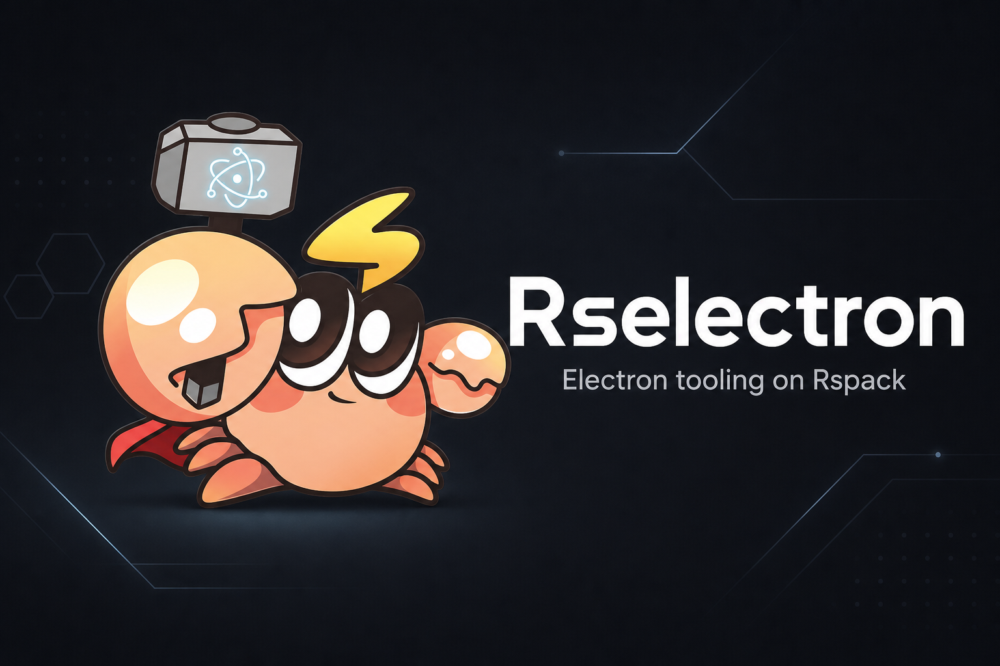

<picture>
  
</picture>

# Rselectron

<p>
  <a href="https://guangzan.github.io/rselectron/"></a>
  <a href="https://www.npmjs.com/package/@rselectron/core"></a>
  <a href="https://nodejs.org/en/about/previous-releases"></a>
  <a href="./LICENSE"></a>
</p>

English | [简体中文](./README.zh.md)

Rselectron is an Rsbuild-first Electron development and build tool. Develop and source-build Electron apps with Rsbuild and Rspack.

## Features

- ⚡️ [Rsbuild](https://rsbuild.rs) / [Rspack](https://rspack.rs) powered, with Electron-oriented defaults
- 🛠 Single config for main, preload, and renderer
- 🚀 Fast builds with Rust-based parallel compilation
- 🔥 Renderer HMR, plus hot reload for main and preload
- 💡 Asset handling tuned for the Electron main process
- ✨ Isolated builds for multi-entry Electron apps
- 🔌 Framework agnostic — use any UI stack your Rsbuild setup supports
- 📦 Out-of-the-box TypeScript support, plus `inspect` for debugging config

## Usage

### Install

```sh
npm i @rselectron/core -D
```

### Development & Build

Add npm scripts to your `package.json`:

```json
{
  "scripts": {
    "dev": "rselectron dev",
    "build": "rselectron build",
    "preview": "rselectron preview"
  }
}
```

### Configuration

When you run the CLI, Rselectron resolves a config file at the project root (for example `rselectron.config.ts`). A minimal config looks like this:

```ts
import { defineConfig } from '@rselectron/core';

export default defineConfig({
  main: {
    root: './src/main',
    source: { entry: { index: './index.ts' } },
  },
  preload: {
    root: './src/preload',
    source: { entry: { index: './index.ts' } },
  },
  renderer: {
    root: './src/renderer',
    source: { entry: { index: './index.ts' } },
  },
});
```

Each of `main` / `preload` / `renderer` is a full Rsbuild config. See the [configuration guide](https://guangzan.github.io/rselectron/config/) for details.

## Getting Started

Start from a learning example in this repository:

|            Example            | Description                                 |
| :---------------------------: | :------------------------------------------ |
| [vanilla](./examples/vanilla) | Minimal Main / Preload / Renderer app       |
|   [react](./examples/react)   | React renderer with `@rsbuild/plugin-react` |

```bash
cd examples/vanilla
pnpm install
pnpm dev
```

Full walkthrough: [Getting Started](https://guangzan.github.io/rselectron/guide/getting-started).
